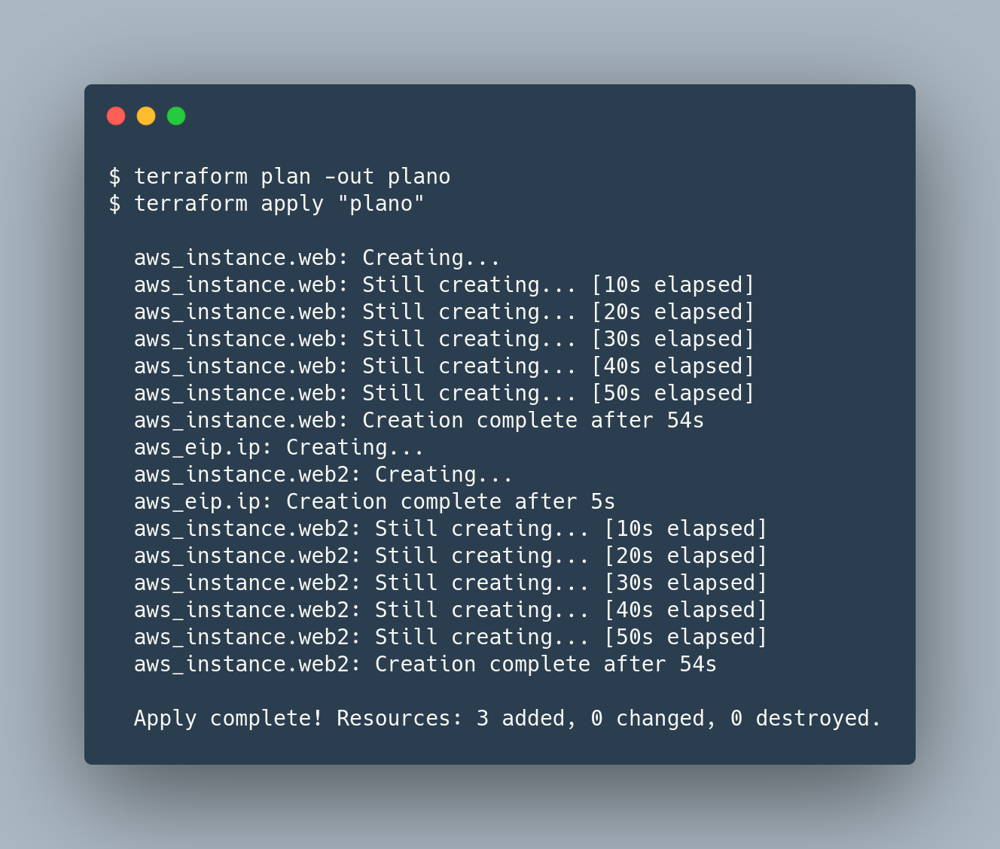
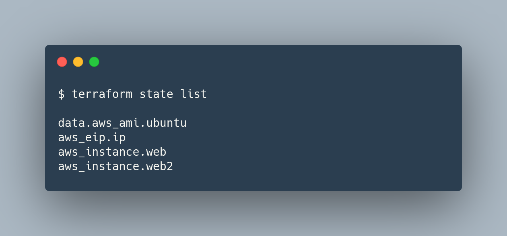

# 1 - Dependências
Em grande maioria, o Terraform infere dependências entre recursos com base na configuração forneceida, para que os recursos sejam criados e destruídos na ordem correta. Eventualmente, o Terraform não pode inferir dependências entre diferentes partes da infraestrutura, nesse caso, será necessário criar uma dependência explícita com o `depends_on`.

O recurso `aws_eip` loca e associa um IP elástico a uma instância EC2. A instância deve existir antes que o IP possa ser criado e anexado, O terraform deve garantir que `aws_instance.web` seja criado antes de `aws_eip.ip`. Sendo esta, uma dependência implícita.

O argumento `depends_on` é aceito por qualquer recurso ou bloco de módulo e aceita uma lista de recursos para os quais criar dependências explícitas. O terraform espera até  que `aws_instance.web` seja criado para começar a criar os recursos `aws_eip.ip` e `aws_instance.web2`

# 2 - state list
Listará todos os recursos e módulos no arquivo de estado:

[Command: state list](https://www.terraform.io/docs/cli/commands/state/list.html)

# 3 - taint / untaint
Informa ao Terraform que um determintado objeto está degradado ou danificado. O comando `terraform taint` marca o objeto como `tainted` no arquivo de estado.
Caso o objeto tenha sido marcado como `tainted` erroneamente, o comando `terraform untaint` pode ser usado para remover a marcação desse objeto.

[Command: taint](https://www.terraform.io/docs/cli/commands/taint.html)
[Command: untaint](https://www.terraform.io/docs/cli/commands/untaint.html)