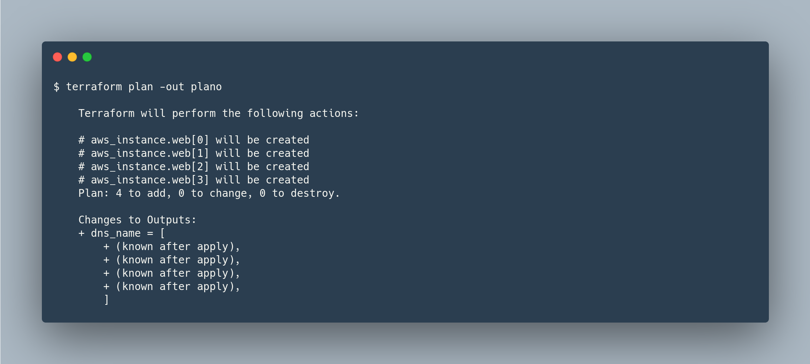

# 1 Expressões - Operadores aritméticos e lógicos

Um operador é um tipo de expressão que transforma ou combina uma ou mais outras expressões. Os operadores combinam dois valores de alguma forma para produzir um terceiro valor de resultado ou transformam um único valor fornecido para produzir um único resultado.

[Expressions - Operators](https://www.terraform.io/docs/language/expressions/operators.html)

1. No arquivo `variable.tf` está contida a [variable](https://www.terraform.io/docs/language/values/variables.html) *environment* que por padrão é *production*. Em `ec2.tf` no argumento count, há um operador de igualdade que irá verificar se *var.environment* é igual a *production*, caso positivo, irá criar 2 instancias e caso negativo criará apenas 1 instancia. Ao executar o `terraform plan` é possível observar o resultado.

2. Adicionada a variavel *plus* que por default é igual a 2. Nesse cenário, se o environment for igual a production, serão provisionadas 2 instancias mais o valor de  *var.plus*. Ao executar o `terraform plan` é possível conferir o resultado.

3. Adicionada a variavel *production* que por default é true. Ao passar pela condicional criada `count = var.production ? 2 : 1` se for verdadeira serão provisionadas duas instancias, se falsa apenas 1 instanca, similar ao cenário 1.

2. No resource *aws_instance*, o argumento `instance_type` contém um [count_index](https://www.terraform.io/docs/language/meta-arguments/count.html#the-count-object). O número de indice da primeira instancia é 0, logo, ao passar no `count_index` uma *t2.micro* será provisionada. Havendo mais de uma instancia a ser provisionada, as demais seram *t2.medium*
